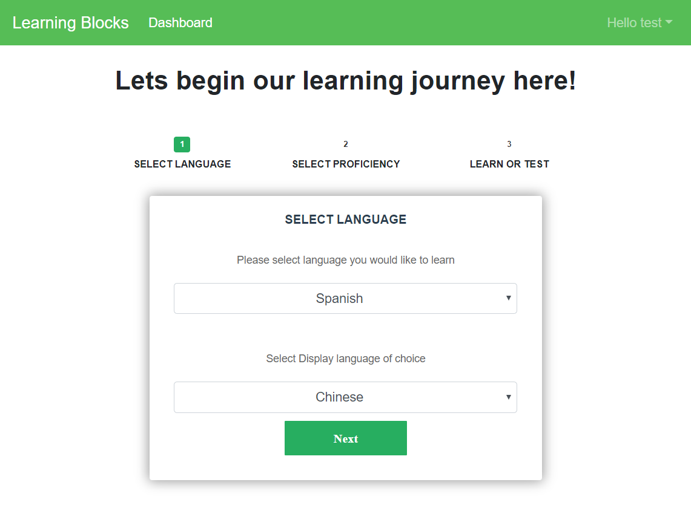
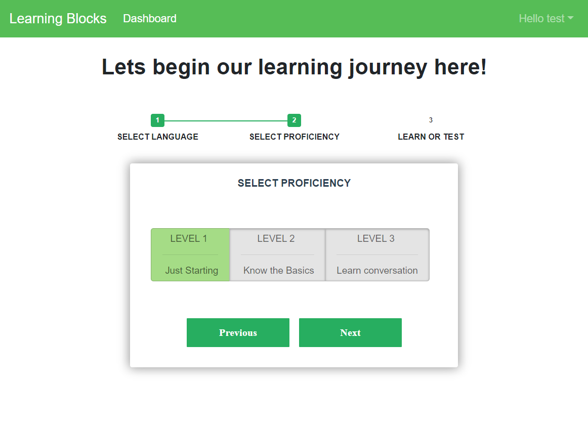
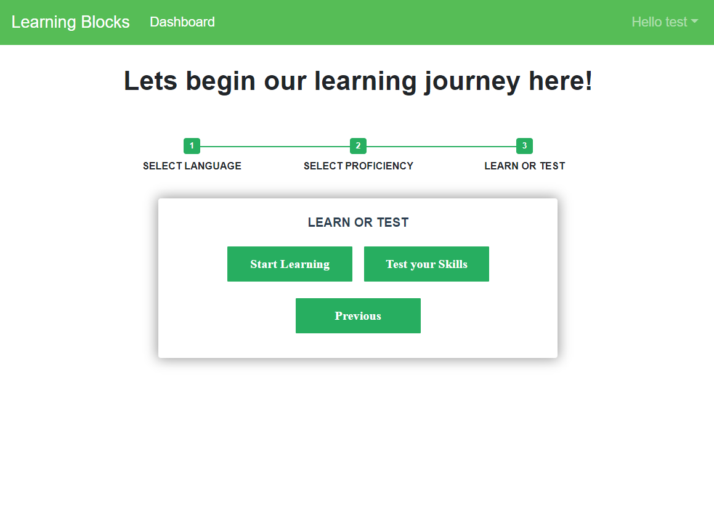
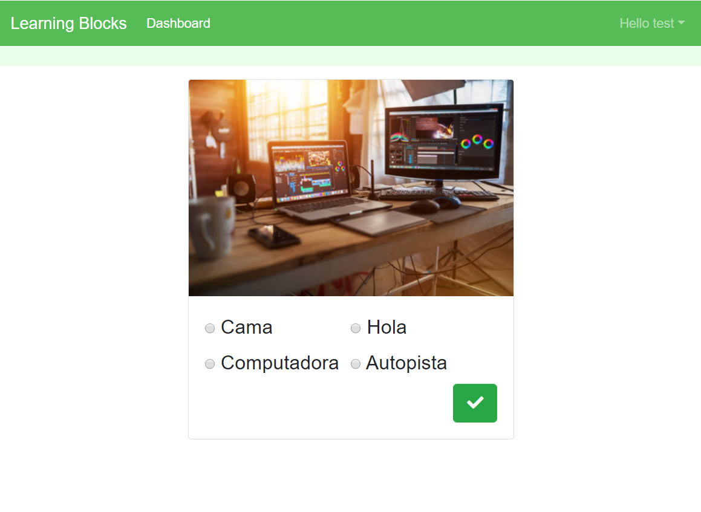
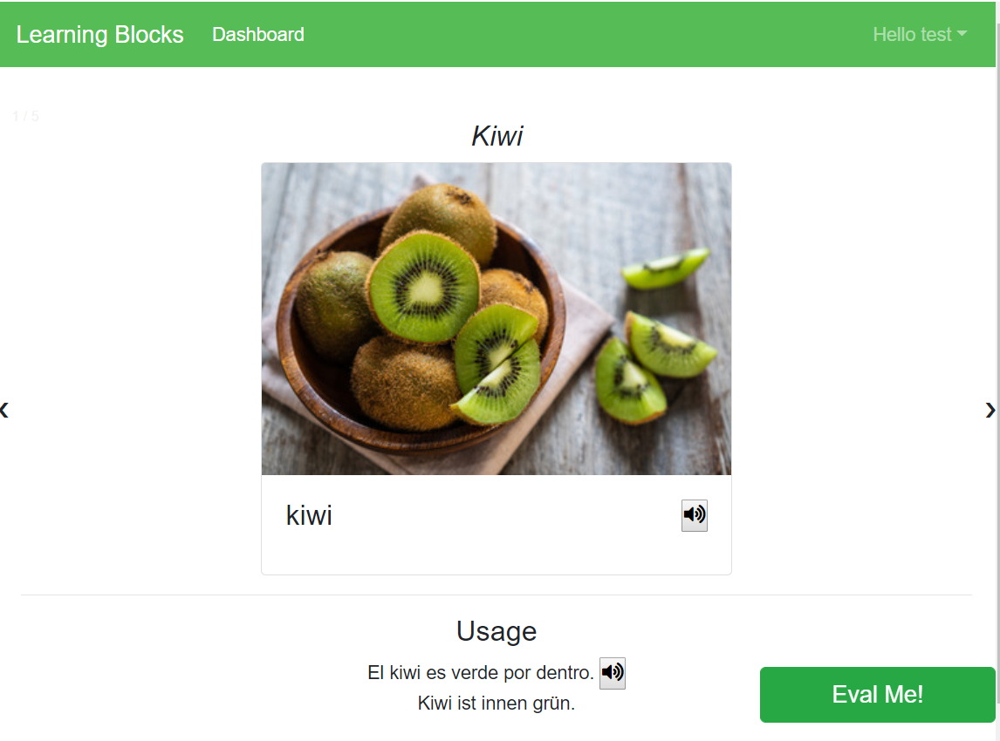

# Learning Block
## Problem Statement
Learning Blocks is a web based language learning tool for individuals who want to learn any new language. A user can register and learn supported languages. Users can choose the target language which they want to learn as well as native language in which they are more comfortable in learning. As of now we support English, Spanish, Russian, Italian, French, German, Dutch, Arabic and Chinese which can be chosen as either native or target language. 
The Learning Blocks provide 3 different levels of proficiency for languages. Users can choose any level of difficulty. Users also have an option to test their knowledge before going into the learning session. After every learning session an evaluation is being done for the same difficulty level. 

## Screenshots
<div style="overflow: auto;">
  
  
  
</div>

<div style="overflow: auto;">
  
  
</div>

# First time use
1. Clone the repo.
```
git clone
```

2. Install the dependencies. 
```
npm install
```

3. Start the node process
```
npm start # Mac
npm run startwin # Windows
```

# Workflow Tips
## Branching

1. First switch to dev branch, and do a git fetch and pull to update your local repo to the latest.
```
git checkout dev
git fetch --all
git pull
```
2. Create a new branch for the specific feauture you are working on.
```
git checkout -b my-new-feature-branch
```

3. Track all the new files by adding them to the repo and commit your changes.
```
git add .
git commit -a -m "a commit message"
```

4. Push your branch to the repo and create a pull request from github
```
git push origin my-new-feature-brach
```

5. Make sure to switch back to the dev branch and create another branch before starting to work on aother feauture.
```
git checkout dev
```


## Linting
To maintain coding structure and following standards, this project uses ESLint.
```
npm run lint
```

## Nodemon
We are using nodmon for which restarts the nodejs application automatically whenever it detects a file change. The nodemon script is already added to the "npm start" command in the package.json file.